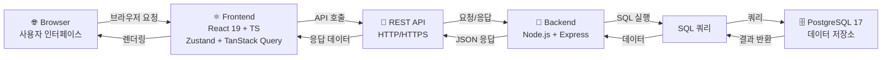
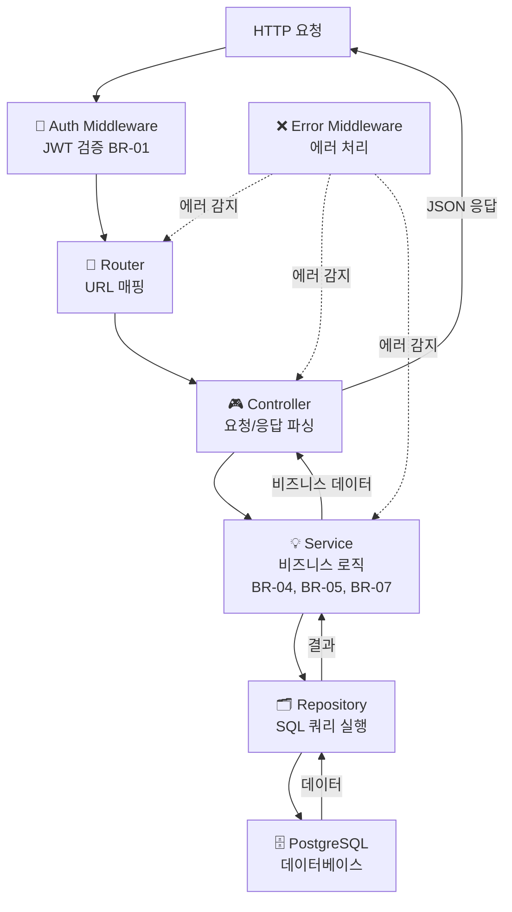
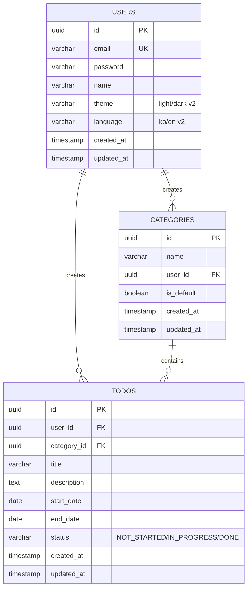

# 기술 아키텍처 다이어그램 — TodoList 앱

---

## 문서 정보

| 항목   | 내용                     |
| ------ | ------------------------ |
| 버전   | v1.0                     |
| 작성일 | 2026-05-27               |
| 형식   | Mermaid 플로우차트 & ERD |

---

## 다이어그램 1: 전체 시스템 구성

**설명:**  
사용자가 브라우저를 통해 React 프론트엔드에 접근합니다. 프론트엔드는 HTTPS REST API를 통해 Express 백엔드와 통신하며, 백엔드는 pg 라이브러리로 PostgreSQL 데이터베이스에 접근합니다. 모든 계층이 명확하게 분리되어 있습니다.

---

## 다이어그램 2: 백엔드 레이어 구조

**설명:**  
백엔드는 5단계 레이어로 구성됩니다. 인증 미들웨어가 모든 요청을 검증하고, 라우터는 URL을 컨트롤러로 매핑하며, 컨트롤러는 요청 파싱만 담당합니다. 서비스는 도메인 규칙(BR)을 집행하는 비즈니스 로직 중심이고, 리포지토리는 순수 SQL 실행만 담당합니다. 전역 에러 미들웨어가 모든 계층의 예외를 처리합니다.

---

## 다이어그램 3: 데이터베이스 ERD

**설명:**  
3개 테이블(users, categories, todos)로 구성된 정규화된 스키마입니다. users는 모든 데이터의 주체이고, categories와 todos는 각각 user_id를 외래키로 가져 데이터 격리를 보장합니다. categories의 is_default 플래그가 기본 카테고리 보호 규칙(BR-07)을 지원하며, todos의 status 필드가 상태 전이(BR-05)를 관리합니다.

---
