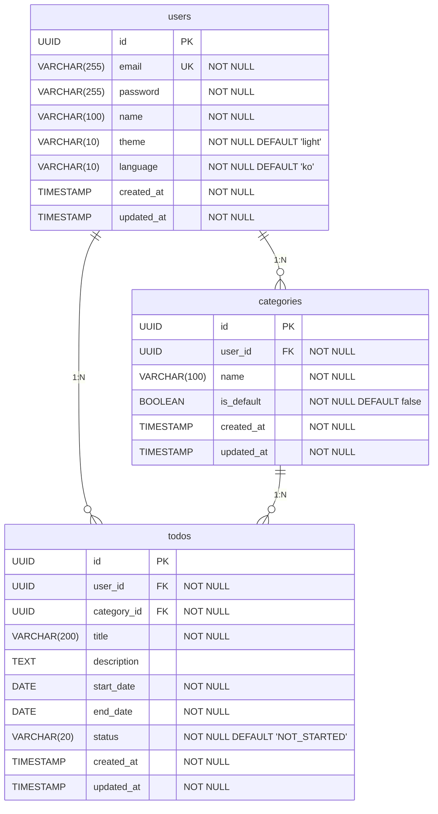

# ERD (Entity Relationship Diagram) — TodoList 앱

| 항목   | 내용       |
| ------ | ---------- |
| 버전   | v1.0       |
| 작성일 | 2026-05-27 |

---

## ERD 다이어그램

---

## 테이블 컬럼 상세

### users

| 컬럼명     | 타입         | 제약                      | 설명                           |
| ---------- | ------------ | ------------------------- | ------------------------------ |
| id         | UUID         | PK                        | 사용자 고유 식별자             |
| email      | VARCHAR(255) | UNIQUE, NOT NULL          | 로그인 이메일 (BR-09)          |
| password   | VARCHAR(255) | NOT NULL                  | bcrypt 해시 비밀번호           |
| name       | VARCHAR(100) | NOT NULL                  | 사용자 이름                    |
| theme      | VARCHAR(10)  | NOT NULL, DEFAULT 'light' | UI 테마 (`light`\|`dark`) [v2] |
| language   | VARCHAR(10)  | NOT NULL, DEFAULT 'ko'    | UI 언어 (`ko`\|`en`) [v2]      |
| created_at | TIMESTAMP    | NOT NULL                  | 가입일시                       |
| updated_at | TIMESTAMP    | NOT NULL                  | 정보 수정일시                  |

### categories

| 컬럼명     | 타입         | 제약                    | 설명                       |
| ---------- | ------------ | ----------------------- | -------------------------- |
| id         | UUID         | PK                      | 카테고리 고유 식별자       |
| user_id    | UUID         | FK → users.id, NOT NULL | 소유 사용자                |
| name       | VARCHAR(100) | NOT NULL                | 카테고리 이름              |
| is_default | BOOLEAN      | NOT NULL, DEFAULT false | 기본 카테고리 여부 (BR-07) |
| created_at | TIMESTAMP    | NOT NULL                | 생성일시                   |
| updated_at | TIMESTAMP    | NOT NULL                | 수정일시                   |

### todos

| 컬럼명      | 타입         | 제약                            | 설명                                        |
| ----------- | ------------ | ------------------------------- | ------------------------------------------- |
| id          | UUID         | PK                              | 할일 고유 식별자                            |
| user_id     | UUID         | FK → users.id, NOT NULL         | 소유 사용자                                 |
| category_id | UUID         | FK → categories.id, NOT NULL    | 소속 카테고리                               |
| title       | VARCHAR(200) | NOT NULL                        | 할일 제목                                   |
| description | TEXT         | NULL 허용                       | 상세 내용                                   |
| start_date  | DATE         | NOT NULL                        | 시작일자                                    |
| end_date    | DATE         | NOT NULL                        | 종료일자 (BR-04)                            |
| status      | VARCHAR(20)  | NOT NULL, DEFAULT 'NOT_STARTED' | 상태 (`NOT_STARTED`\|`IN_PROGRESS`\|`DONE`) |
| created_at  | TIMESTAMP    | NOT NULL                        | 등록일시                                    |
| updated_at  | TIMESTAMP    | NOT NULL                        | 수정일시                                    |

---

## 도메인 규칙 반영

| 규칙                                   | 구현 방식                  | 대상                              |
| -------------------------------------- | -------------------------- | --------------------------------- |
| BR-04: end_date >= start_date          | CHECK 제약                 | todos.end_date                    |
| BR-07: 기본 카테고리 수정·삭제 불가    | 애플리케이션 레벨 403 반환 | categories.is_default             |
| BR-08: 사용자 삭제 시 연관 데이터 삭제 | ON DELETE CASCADE          | categories.user_id, todos.user_id |
| BR-09: 이메일 중복 금지                | UNIQUE 제약                | users.email                       |
