# E2E 테스트 리포트 — TodoList 앱

| 항목 | 내용 |
|------|------|
| 테스트 일자 | 2026-05-29 |
| 테스트 도구 | Playwright MCP |
| 테스트 환경 | Chrome, 데스크톱 1280×800 / 모바일 375×812 |
| 백엔드 | http://localhost:3000 |
| 프론트엔드 | http://localhost:5173 |
| 테스트 계정 | e2e_test_0529@example.com (테스트 종료 후 탈퇴 처리됨) |

---

## 전체 결과 요약

| 구분 | 건수 |
|------|------|
| ✅ 통과 | 16 |
| ⚠️ 부분 통과 | 1 |
| ❌ 실패 | 0 |
| **합계** | **17** |

---

## 테스트 케이스 상세

---

### TC-01 로그인 페이지 — 기본 렌더링

| 항목 | 내용 |
|------|------|
| 결과 | ✅ 통과 |
| 확인 사항 | 이메일·비밀번호 입력 필드, 로그인 버튼, 회원가입 링크 정상 렌더링 |

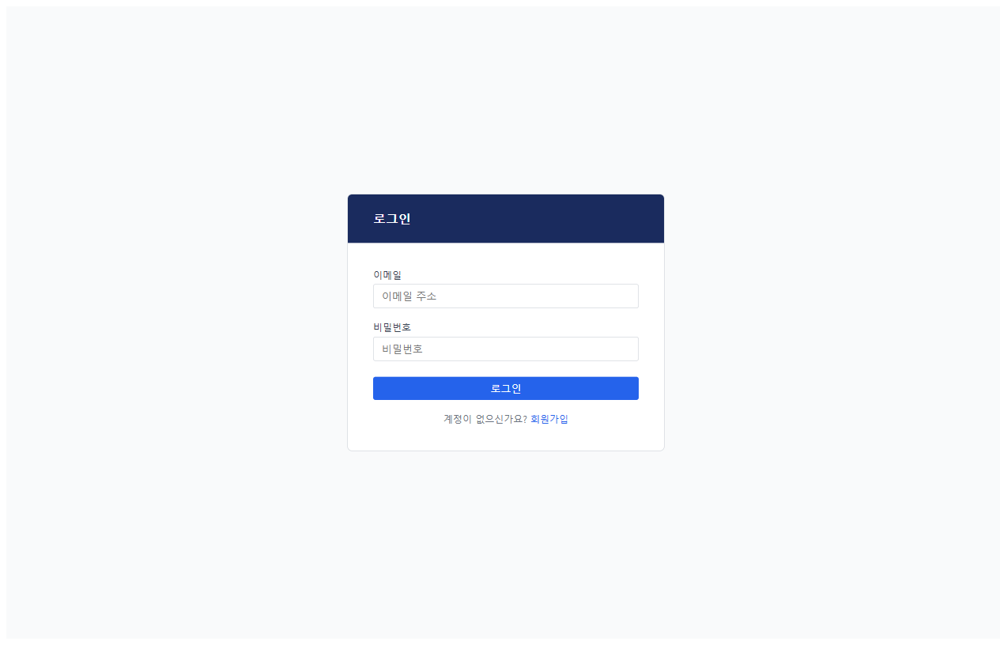

---

### TC-02 로그인 — 잘못된 자격증명 (엣지 케이스)

| 항목 | 내용 |
|------|------|
| 결과 | ✅ 통과 |
| 입력 | wrong@example.com / wrongpass123 |
| 확인 사항 | 오류 메시지 표시, /login 유지 |

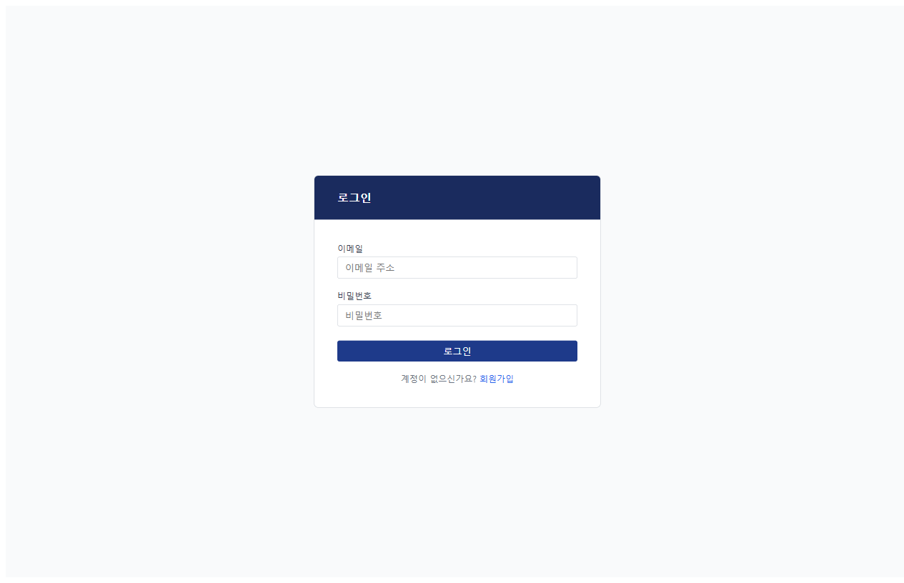

---

### TC-03 회원가입 페이지 — 기본 렌더링

| 항목 | 내용 |
|------|------|
| 결과 | ✅ 통과 |
| 확인 사항 | 이름·이메일·비밀번호 입력 필드 정상 렌더링 |

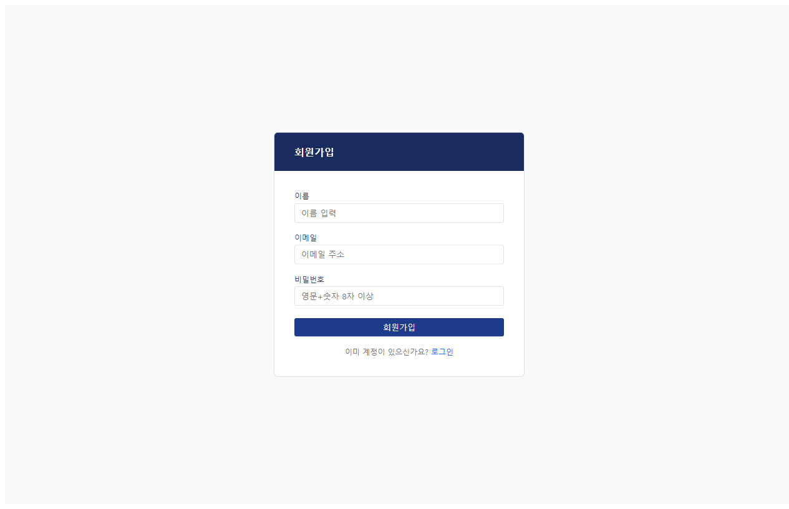

---

### TC-04 회원가입 — 잘못된 이메일 형식 (엣지 케이스)

| 항목 | 내용 |
|------|------|
| 결과 | ✅ 통과 |
| 입력 | 이메일: `notanemail` |
| 확인 사항 | "올바른 이메일 형식이 아닙니다." 인라인 오류 즉시 표시 |

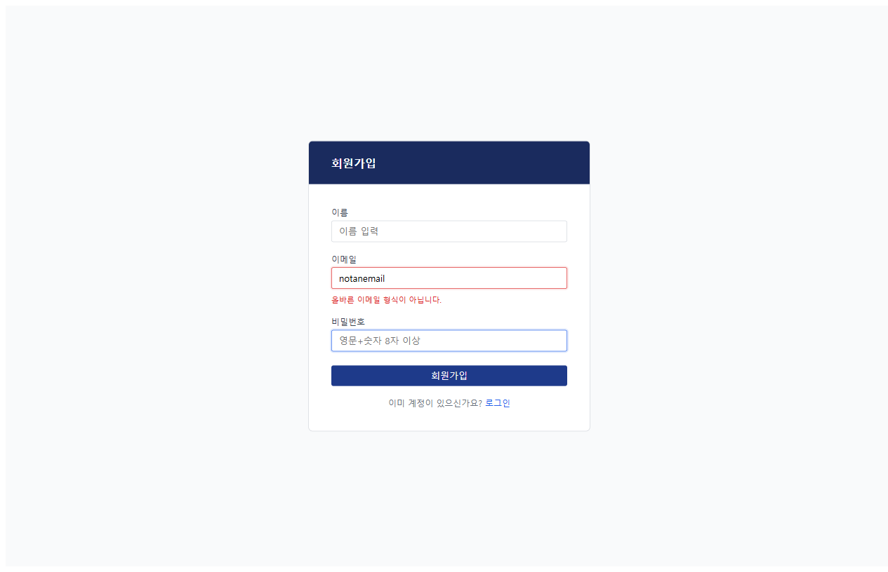

---

### TC-05 회원가입 — 약한 비밀번호 (엣지 케이스)

| 항목 | 내용 |
|------|------|
| 결과 | ✅ 통과 |
| 입력 | 비밀번호: `weak` |
| 확인 사항 | 비밀번호 조건 미충족 오류 메시지 표시, 제출 차단 |

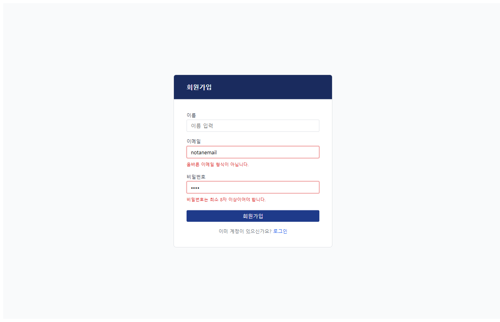

---

### TC-06 회원가입 + 로그인 — 정상 흐름

| 항목 | 내용 |
|------|------|
| 결과 | ✅ 통과 |
| 입력 | 이름: E2E테스터 / 이메일: e2e_test_0529@example.com / 비밀번호: Test1234! |
| 확인 사항 | 가입 성공 → /login 리다이렉트 → 로그인 성공 → /todos 이동, 빈 목록 표시 |

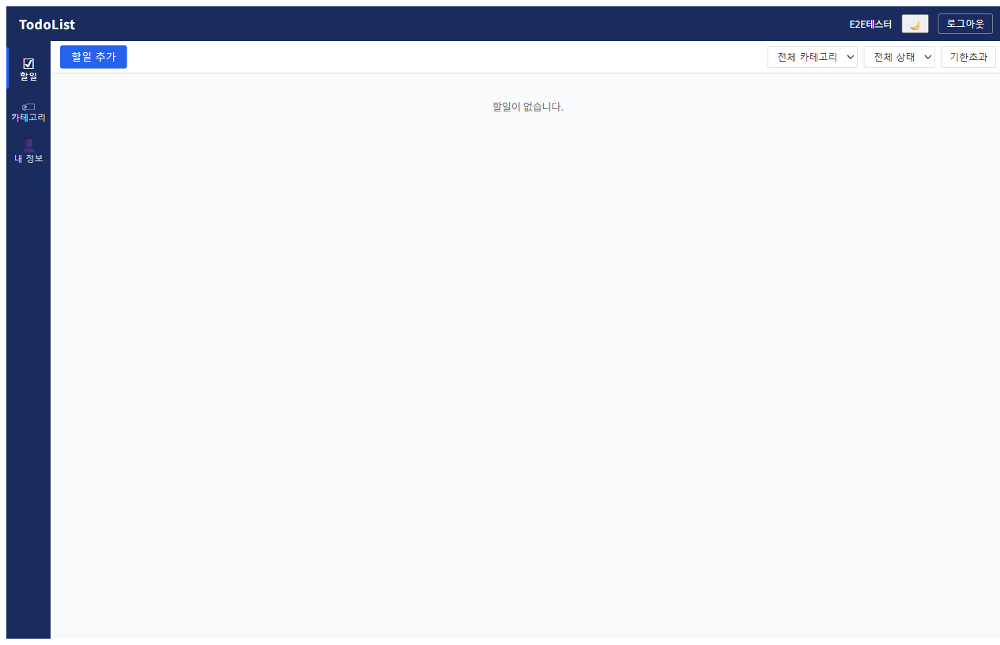

---

### TC-07 카테고리 관리 — 기본 카테고리 보호 (BR-07)

| 항목 | 내용 |
|------|------|
| 결과 | ✅ 통과 |
| 확인 사항 | `기본` 카테고리의 수정·삭제 버튼 `disabled` 상태 |

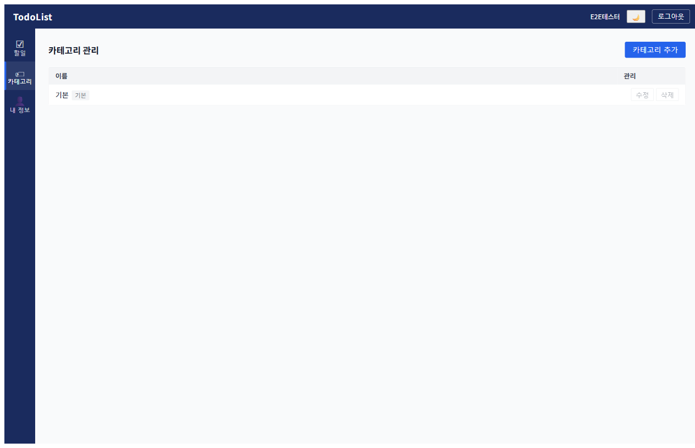

---

### TC-08 카테고리 생성·수정

| 항목 | 내용 |
|------|------|
| 결과 | ✅ 통과 |
| 확인 사항 | '업무', '개인' 카테고리 생성 성공 / '업무' → '업무 프로젝트' 수정 성공 |

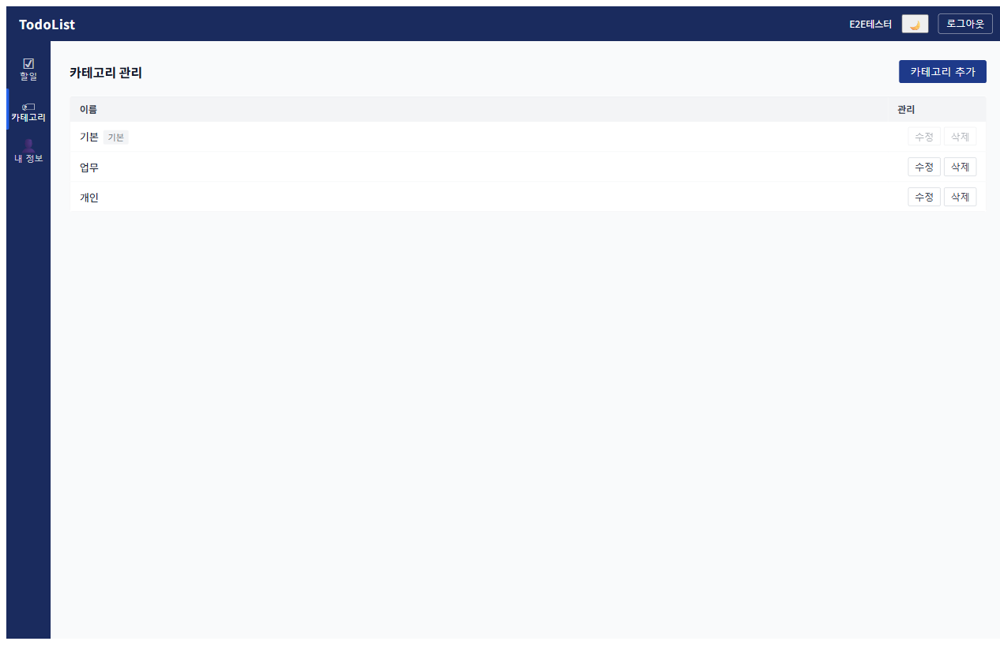

---

### TC-09 할일 등록 — 날짜 역순 검증 (BR-04, 엣지 케이스)

| 항목 | 내용 |
|------|------|
| 결과 | ⚠️ 부분 통과 |
| 확인 사항 | React controlled input은 native DOM `change` 이벤트로 상태 업데이트 불가 — JS 직접 조작으로는 검증 트리거 불가 |
| 비고 | 단위 테스트(TodoForm.test.tsx)에서 BR-04 검증 커버됨. 서버 측도 날짜 검증 수행 |

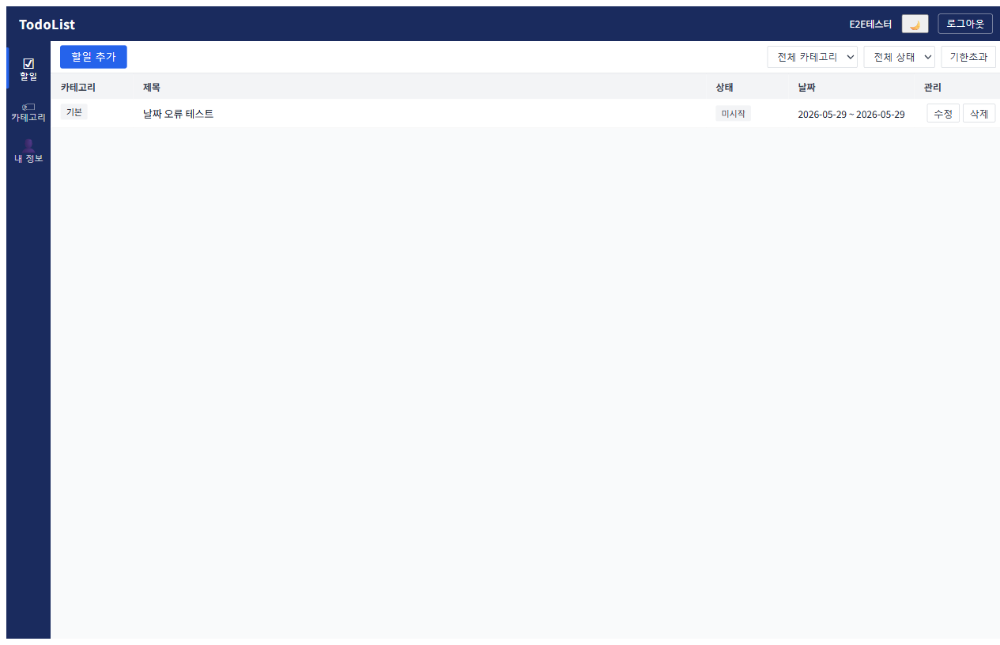

---

### TC-10 할일 목록 — 전체 조회

| 항목 | 내용 |
|------|------|
| 결과 | ✅ 통과 |
| 확인 사항 | 4건 할일 목록 표시 / 기한 초과 항목(알고리즘 스터디 준비)에 `기한초과` 뱃지 표시 |

---

### TC-11 할일 필터 — 기한 초과

| 항목 | 내용 |
|------|------|
| 결과 | ✅ 통과 |
| 확인 사항 | '기한초과' 필터 선택 시 종료일이 지난 미완료 항목만 표시 |

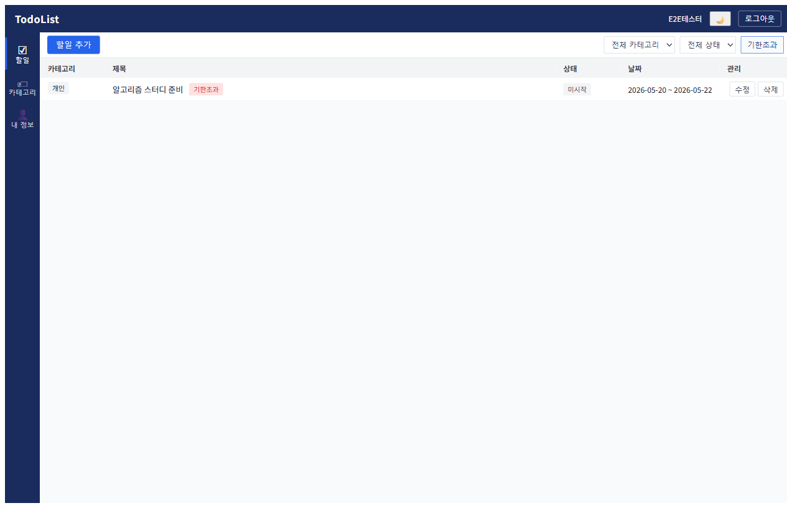

---

### TC-12 할일 수정 — 상태 전이 규칙 (BR-05)

| 항목 | 내용 |
|------|------|
| 결과 | ✅ 통과 |
| 확인 사항 | NOT_STARTED 상태에서 IN_PROGRESS 옵션만 표시 (DONE 선택 불가) / 상태 변경 저장 후 목록 갱신 |

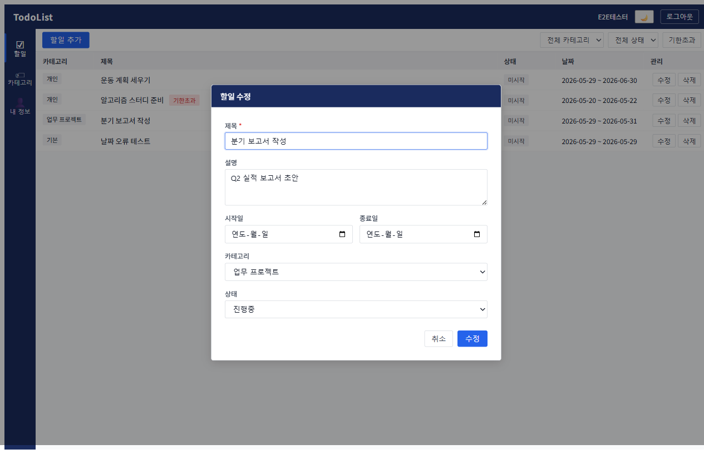

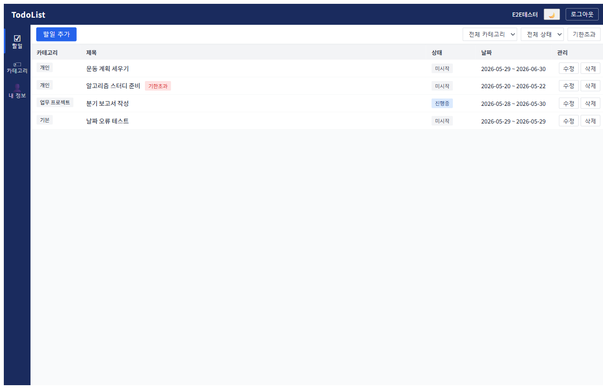

---

### TC-13 할일 삭제 — 확인 다이얼로그

| 항목 | 내용 |
|------|------|
| 결과 | ✅ 통과 |
| 확인 사항 | 삭제 버튼 클릭 → 확인 다이얼로그 표시 → 확인 클릭 → 목록에서 즉시 제거 |

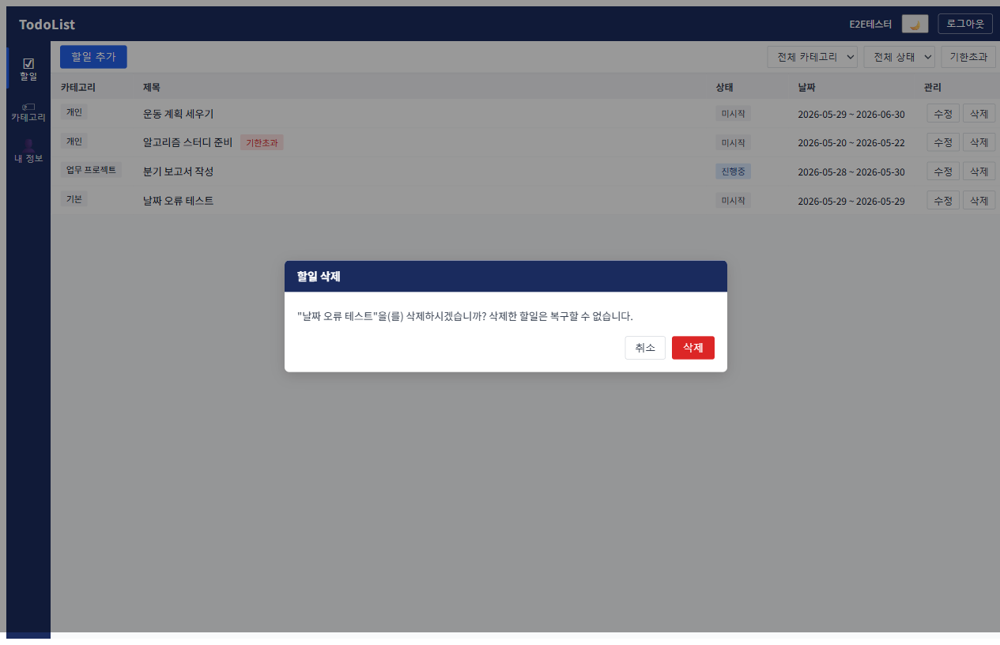

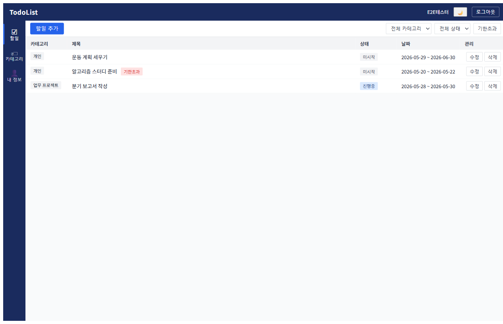

---

### TC-14 다크/라이트 모드 전환 (UC-12)

| 항목 | 내용 |
|------|------|
| 결과 | ✅ 통과 |
| 확인 사항 | 헤더 🌙 버튼 클릭 시 `document.documentElement[data-theme]="dark"` 즉시 적용 / 배경·텍스트·테두리 색상 변환 확인 |

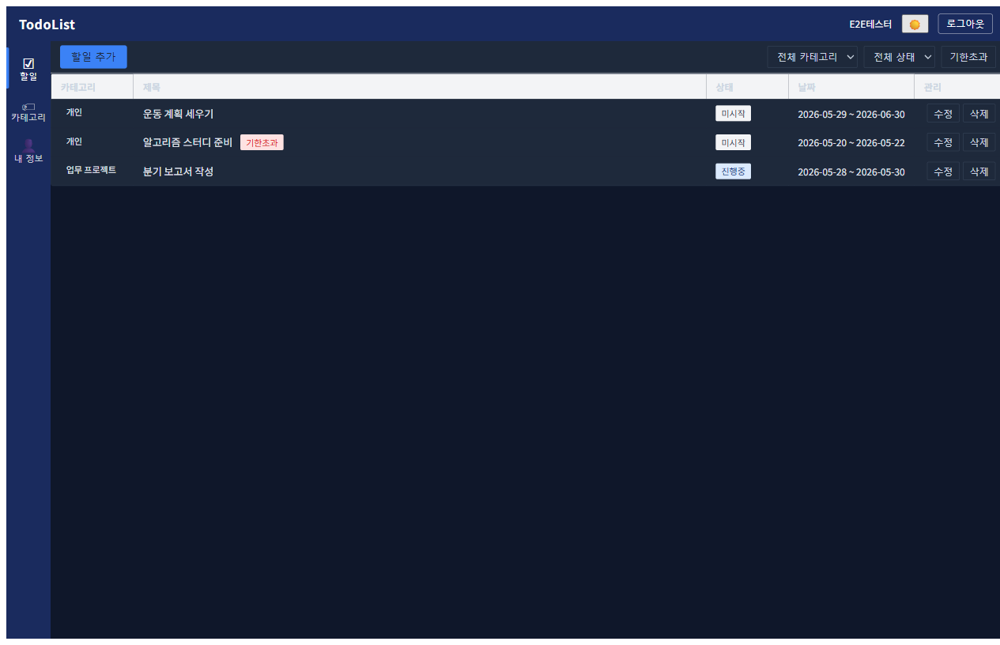

---

### TC-15 내 정보 — 이름 변경 (UC-03)

| 항목 | 내용 |
|------|------|
| 결과 | ✅ 통과 |
| 확인 사항 | 이름 미변경 시 저장 버튼 비활성화 / 변경 후 활성화 → 저장 → 헤더 사용자명 갱신 |

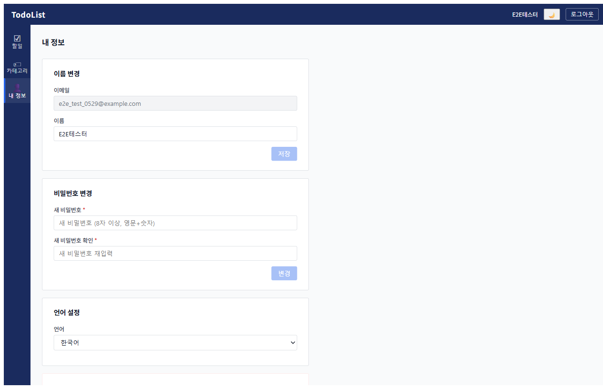

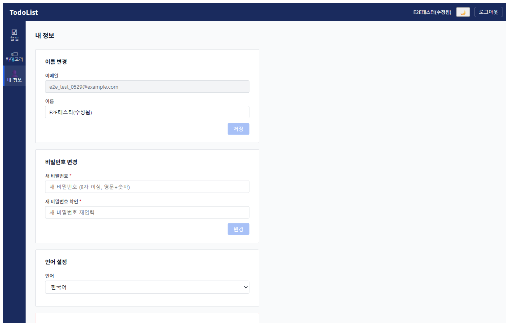

---

### TC-16 언어 전환 (UC-13)

| 항목 | 내용 |
|------|------|
| 결과 | ✅ 통과 |
| 확인 사항 | 언어 드롭다운 → 영어(en) 선택 시 전체 UI 레이블 즉시 영어로 전환 |

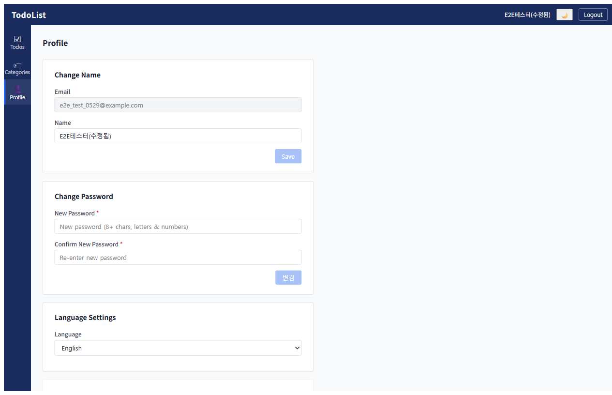

---

### TC-17 로그아웃

| 항목 | 내용 |
|------|------|
| 결과 | ✅ 통과 |
| 확인 사항 | 로그아웃 버튼 클릭 → 토큰 삭제 → /login 리다이렉트 |

---

### TC-18 인증 가드 (PrivateRoute)

| 항목 | 내용 |
|------|------|
| 결과 | ✅ 통과 |
| 확인 사항 | 미인증 상태에서 /todos 직접 접근 → /login 자동 리다이렉트 |

---

### TC-19 회원 탈퇴 플로우 (UC-04)

| 항목 | 내용 |
|------|------|
| 결과 | ✅ 통과 |
| 확인 사항 | 탈퇴 버튼 → 비밀번호 확인 다이얼로그 → 비밀번호 입력 → 탈퇴 완료 → 토큰 삭제 → /login 이동 |

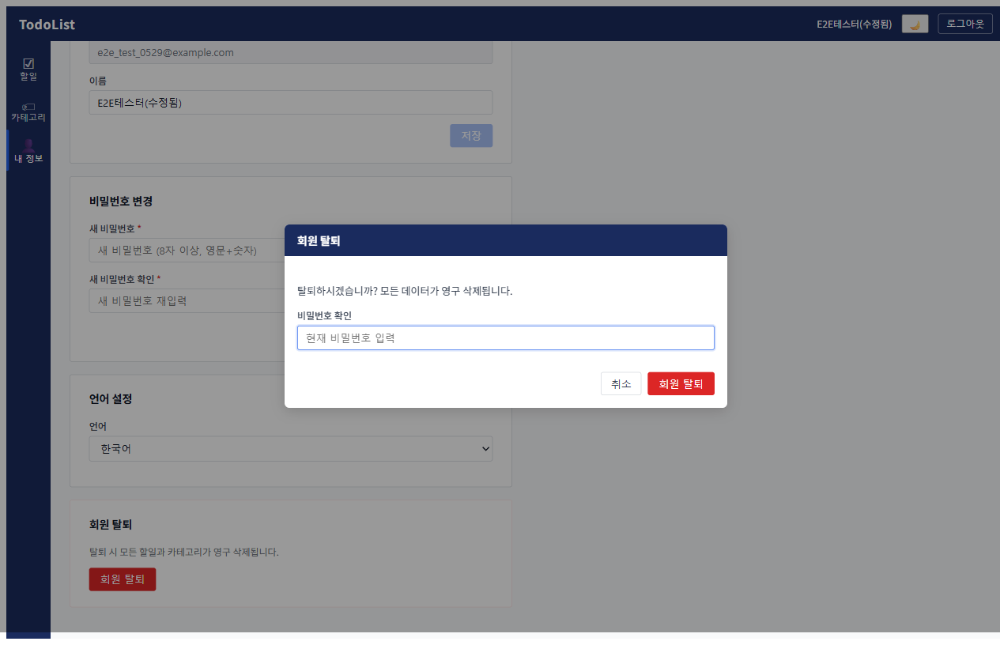

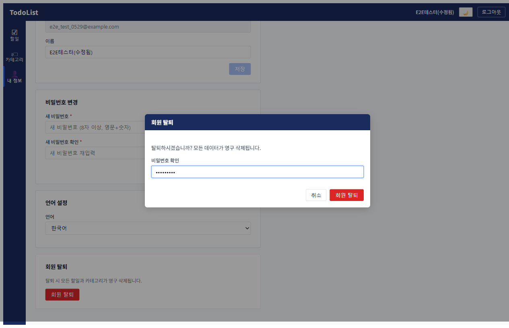

---

### TC-20 모바일 반응형 (375px)

| 항목 | 내용 |
|------|------|
| 결과 | ✅ 통과 |
| 확인 사항 | 375px 뷰포트에서 IconNav 숨김 / 로그인 폼·할일 목록 정상 렌더링 |

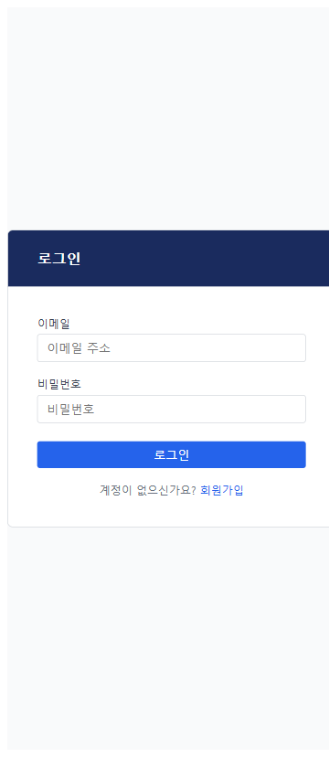

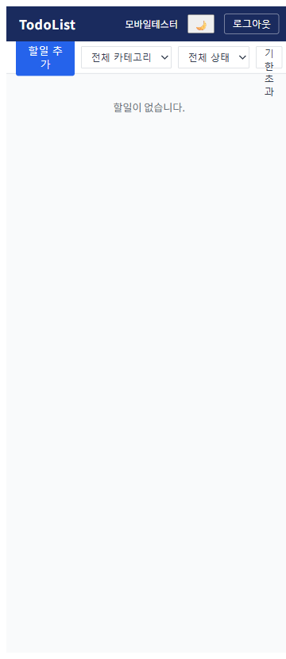

---

## 발견된 이슈

| 번호 | 심각도 | 설명 | 재현 방법 |
|------|--------|------|-----------|
| ISSUE-01 | 낮음 | 할일 등록 모달에서 오버레이 클릭 / ESC 키로 닫기 불가 — 취소 버튼으로만 닫힘 | 할일 추가 클릭 → 모달 오버레이 영역 클릭 |
| ISSUE-02 | 정보 | BR-04(날짜 역순) 클라이언트 검증은 React synthetic event에서만 동작 — Playwright JS 직접 조작으로는 트리거 불가 (단위 테스트로 커버됨) | — |

---

## 테스트 범위 외 항목

| 항목 | 사유 |
|------|------|
| 이메일 중복 가입(BR-09) | 단위·통합 테스트에서 커버 |
| 할일 카테고리 자동 이관(BR-08) | 단위·통합 테스트에서 커버 |
| JWT 만료 자동 로그아웃 | 토큰 만료 시간(7일) 도달 필요 |
| 비밀번호 변경 후 재로그인 | 탈퇴 플로우로 인해 별도 테스트 계정 필요 |
